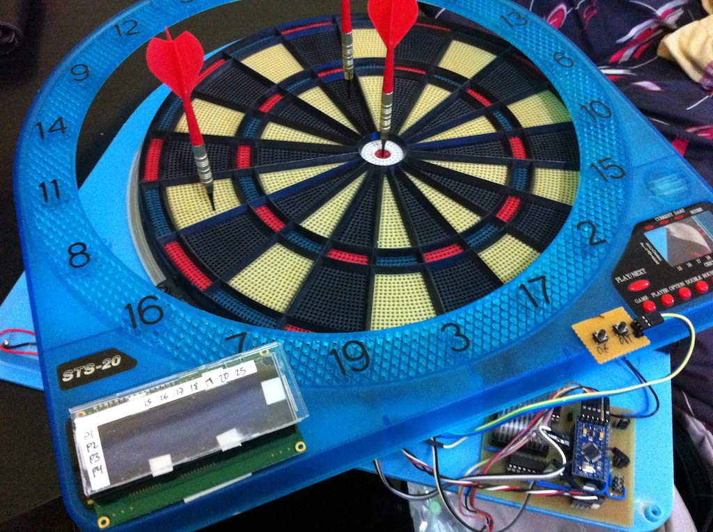
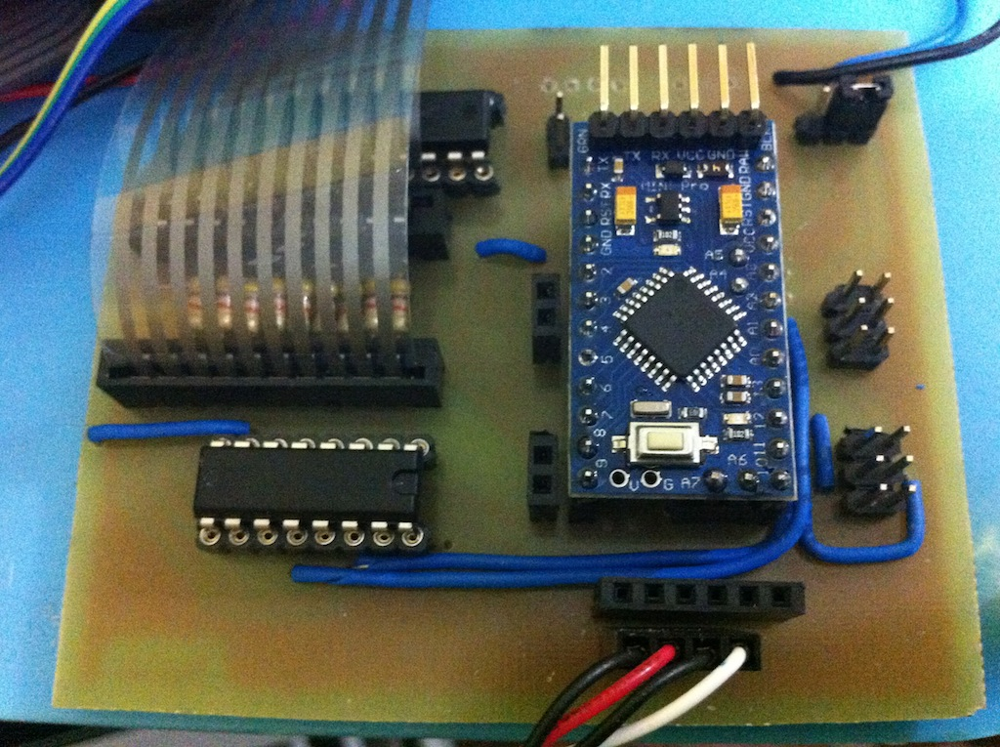

ArduinoDartsBoard
=================

Electronic darts board controlled by Arduino Mini Pro. It's o a very early development status. Only cricket game is implemented and has some bugs.

I built the software and the pcb from scratch. I'll upload the pcb diagrams as soon as I can.

Sample of the game finished melody: http://www.youtube.com/watch?v=AD7XjPF0V5o